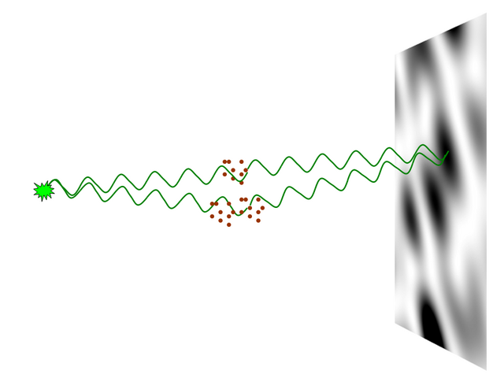
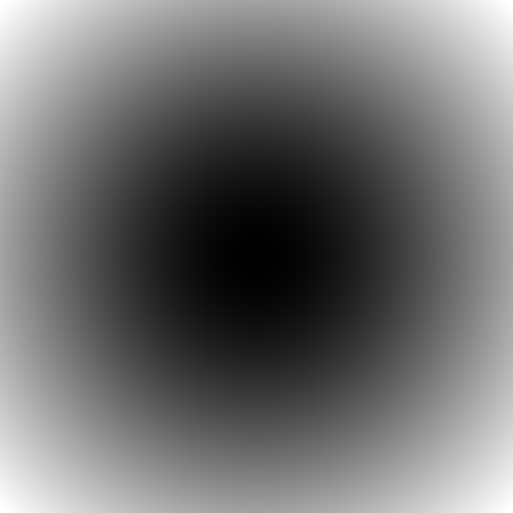
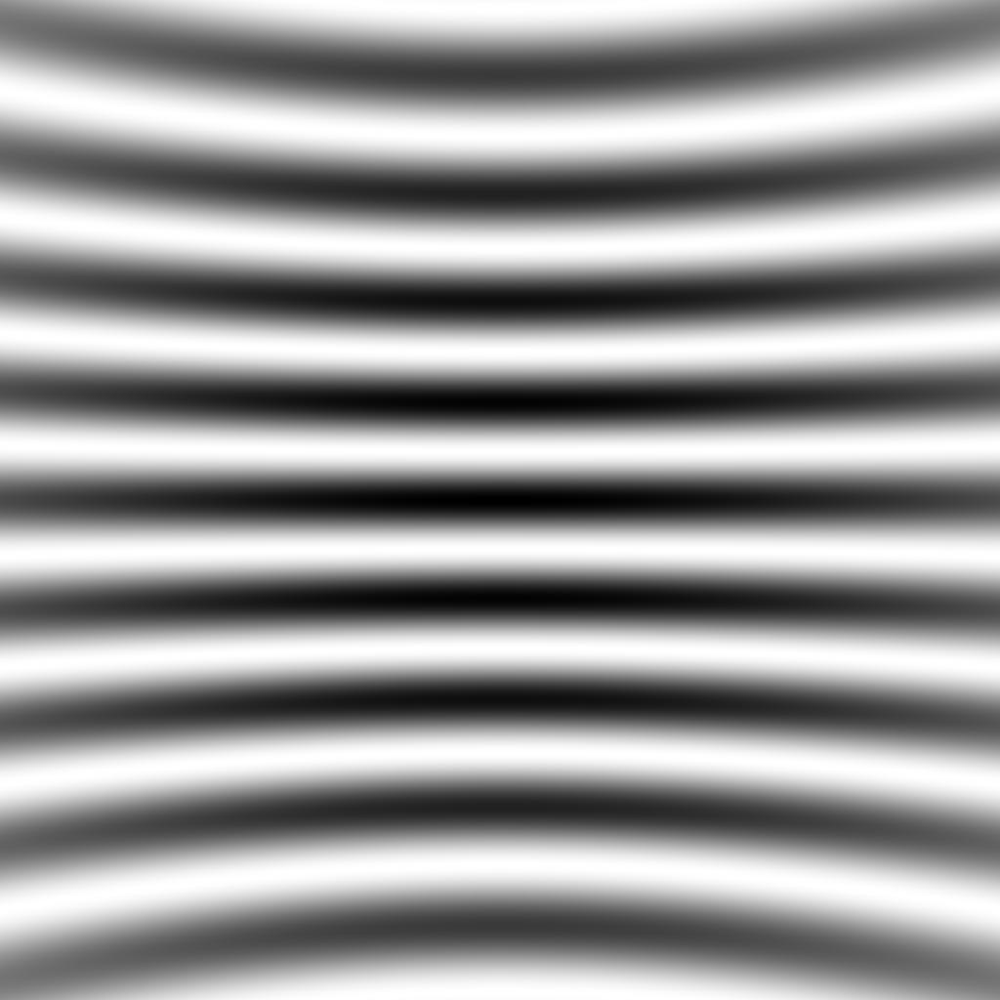
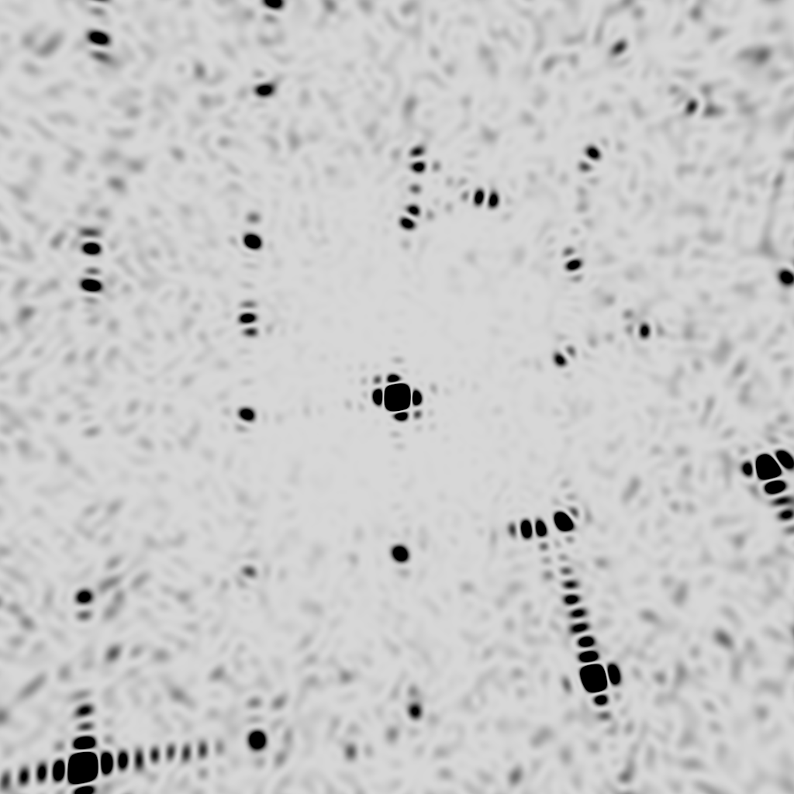
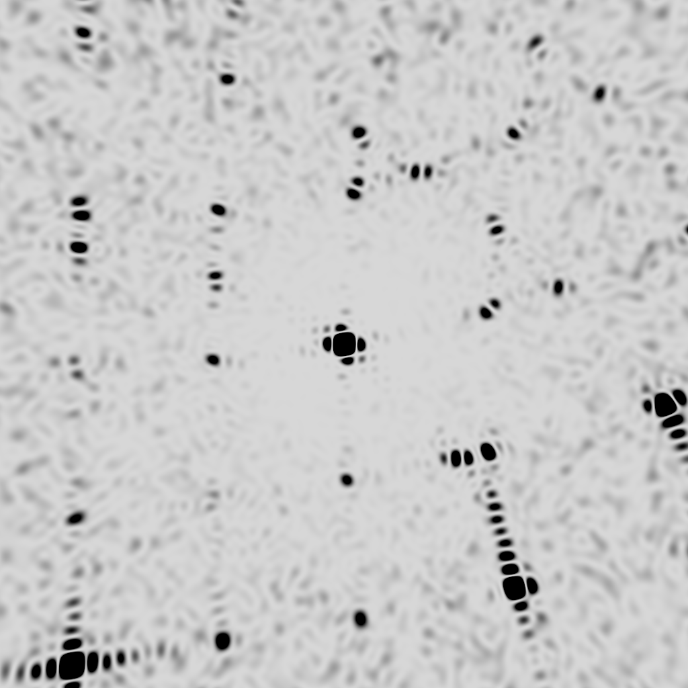
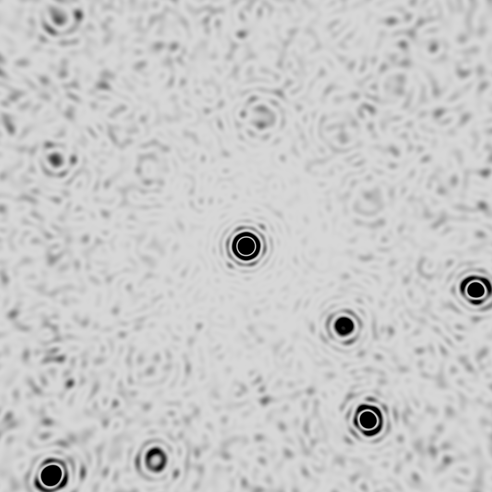

# nearBragg

diffraction image simulator for near- and far-field scattering from arbitrary
electron locations in space



The nearBragg program is a very simplistic yet general calculation of the total
scattering from a bunch of "atoms" which the user provides as a 3-column text
file of x-y-z coordinates in Angstroms.  Each atom is considered to be a point
with a structure factor of 1.0 (a single "electron"). The detector is
represented as an array of pixels some distance away from the "crystal"
(in mm), and the "source" is one or more points arranged in space. These all
have sensible defaults.  Scattering is calculated by computing the linear
distance from each point in the source to each of the user-provided "atoms",
and then on to the center of each pixel in the detector. The *sin* and *cos*
of 2 $\pi$ times the number of wavelenghs involved in this total distance is then
added up and the amplitude and phase of the resultant wave from the whole sample
(and the whole source) are obtained for each pixel. The intensity at each pixel
is the square of the amplitude.

No assumptions are made about Bragg's Law, unit cells, shape transforms, or any
of that.  It is simply a calculation of the scattering from the user-provided
points.

## source code

[nearBragg.c](nearBragg.c) (20K)

The auxillary programs [float_add][float_add] and [float_func][float_func] may
be used to add up the raw "float" binary files output by `nearBragg` so that
renderings may be divided up on separate CPUs and then combined together.
The resulting raw files may be converted to images with `nearBragg` using the
`-accumulate` option (see below)

Also, the [phase_color.c](phase_color.c) program will convert the sinimage and
cosimage files output by `nearBragg` into a pretty color-by-phase image.
However, if you want to display the phase of the traditional "structure factor"
, then you need to divide the wave scattered by your structure by the sinimage
and cosimage produced for a single point electron at the origin using the same
camera parameters. This [complex_divide.csh](complex_divide.csh) script may be
helpful for this.

## compile

```bash
gcc -O -O -o nearBragg nearBragg.c -lm -static
```

## example usage

A one atom case

```bash
echo "0 0 0" >! atoms.txt
```

Run the simulation

```bash
./nearBragg -file ./atoms.txt -lambda 1.0
```

View the result

```bash
adxv intimage.img
```

convert and re-scale as regular graphics file using [ImageMagick][imagemagick].

```bash
convert -depth 16 -type Grayscale -colorspace GRAY -endian LSB -size 1024x1024+512 \
  -negate -normalize \
  GRAY:intimage.img intimage.png
```



A two atom case

```bash
cat << EOF >! atoms.txt
0 0 0
0 10 0
EOF
```

Run the simulation

```bash
./nearBragg -file ./atoms.txt -lambda 1.0
```

View the result

```bash
adxv intimage.img
```

Convert and re-scale as regular graphics file

```bash
convert -depth 16 -type Grayscale -colorspace GRAY -endian LSB -size 1024x1024+512 \
  -negate -normalize \
  GRAY:intimage.img intimage.png
  ```



Make a 11x11x11 cube grid with the cell spacing of silicon

```bash
echo "5 5.43071" | ./makelattice.awk >! silicon_nanoparticle.txt
```

Twirl it around

```bash
./rotate.awk -v phix=10 -v phiy=20 -v phiz=30 silicon_nanoparticle.txt >! rotated_xtal.txt
```

Jiggle the atoms by a B factor of 5

```bash
awk '{print $0,5}' rotated_xtal.txt | ./Bscatter.awk >! atoms.txt
```

Do a fast calculation with a "perfect" beam

```bash
./nearBragg -file ./atoms.txt -lambda 1.0 -dispersion 0 \
   -hdivrange 0.0 -vdivrange 0.0 \
 -intfile intimage_ideal.img -floatfile floatimage_ideal.bin
```

View the result

```bash
adxv intimage_ideal.img
```



Add some divergence and dispersion

```bash
./nearBragg -file ./atoms.txt -lambda 1.0 -dispersion 0.1 \
   -hdivrange 0.062 -vdivrange 0.062 -hdivstep 0.031 -vdivstep 0.031 \
 -intfile intimage_realistic.img -floatfile floatimage_realistic.bin
```

View the result

```bash
adxv intimage_realistic.img
```



Same number of atoms, but a round particle

```bash
echo "10 5.43071" | ./makelattice.awk |\
awk '{R=sqrt($1*$1+$2*$2+$3*$3)} R<37.625{print}' |\
cat >! silicon_nanoparticle.txt
```

Twirl it around

```bash
./rotate.awk -v phix=10 -v phiy=20 -v phiz=30 silicon_nanoparticle.txt >! rotated_xtal.txt
```

Jiggle the atoms by a B factor of 5

```bash
awk '{print $0,5}' rotated_xtal.txt | ./Bscatter.awk >! atoms.txt
```

Do a fast calculation with a "perfect" beam

```bash
./nearBragg -file ./atoms.txt -lambda 1.0 -dispersion 0 \
   -hdivrange 0.0 -vdivrange 0.0 \
 -intfile intimage_round.img -floatfile floatimage_ideal.bin
```

View the result

```bash
adxv intimage_round.img
```




## Other examples:

1. [Demonstration of Bragg's Law](braggs_law.md)
2. <a href=collision/>Deminstration of coherence length</a></br>


## Command-line options

***-atom***

number of atoms in the following file

***-file filename.txt***

text file containing point scatterer coordinates in Angstrom relative to the origin.  The x axis is the x-ray beam and Y and Z are parallel to the detector Y and X coordinates, respectively

***-hdivrange***

horizontal angular spread of source points (mrad). Default: 0

***-vdivrange***

vertical angular spread of source points (mrad). Default: 0

***-hdivstep***

number of source points in the horizontal. Default: 1

***-vdivstep***

number of source points in the vertical. Default: 1

***-distance***

distance from origin to detector center (mm)

***-source_distance***

distance from origin to source (mm)

***-source_depth***

distance from front of source to back (mm)

***-depthstep***

number of source points along path to sample. Default: 1

***-detsize***

detector size in x and y (mm)

***-detsize_x***

detector size in x direction (mm)

***-detsize_y***

detector size in y direction (mm)

***-pixel***

detector pixel size (mm)

***-detpixels***

detector size in x and y (pixels)

***-detpixels_x***

detector size in x direction (pixels)

***-detpixels_y***

detector size in y direction (pixels)

***-Xbeam***

direct beam position in x direction (mm) Default: center

***-Ybeam***

direct beam position in y direction (mm) Default: center

***-curved_det***

all detector pixels same distance from sample (origin)

***-oversample***

number of sub-pixels per pixel. Default: 1

***-roi xmin xmax ymin ymax***

only render pixels within a set range. Default: all detector

***-lambda***

incident x-ray wavelength (Angstrom). Default: 1

***-dispersion***

spectral dispersion: delta-lambda/lambda (percent). Default: 0

***-dispsteps***

number of wavelengths in above range. Default: 1

***-floatfile***

name of binary pixel intensity output file (4-byte floats)

***-sinfile***

name of binary imaginary structure factor output file (4-byte floats)

***-cosfile***

name of binary real structure factor output file (4-byte floats)

***-intfile***

name of smv-formatted output file.

***-scale***

scale factor for intfile. Default: fill dynamic range

***-coherent***

coherently add everything, even different wavelengths. Not the default

***-accumulate***

import contents of floatfile or sinfile/cosfile and add to them. Not the default

***-point_pixel***

turn off solid-angle correction for square flat pixels

***-printout***

print pixel values out to the screen

***-noprogress***

turn off the progress meter


[adxv]: http://www.scripps.edu/~arvai/adxv.html
[rigaku]: https://www.rigaku.com
[mosflm]: http://www.mrc-lmb.cam.ac.uk/harry/mosflm/
[hkl]: http://www.hkl-xray.com
[xds]: http://xds.mpimf-heidelberg.mpg.de
[fmodel]: http://www.phenix-online.org/documentation/fmodel.htm
[refmac]: https://www2.mrc-lmb.cam.ac.uk/groups/murshudov/content/refmac/refmac.html
[sfall]: https://www.ccp4.ac.uk/html/sfall.html
[imagemagick]: http://www.imagemagick.org
[noisify]: https://github.com/bl831/bin_stuff/blob/main/docs/noisify.md
[float_add]: https://github.com/bl831/bin_stuff/blob/main/docs/float_add.md
[float_func]: https://github.com/bl831/bin_stuff/blob/main/docs/float_func.md
[int2float]: int2flaot.md
[ccp4]: https://www.ccp4.ac.uk
[maplib]: https://www.ccp4.ac.uk/html/maplib.html
[coot]: https://www2.mrc-lmb.cam.ac.uk/personal/pemsley/coot/
[nanobragg]: https://github.com/bl831/nanoBragg
[nearbragg]: https://github.com/bl831/nearBragg
[nonbragg]: https://github.com/bl831/nanoBragg