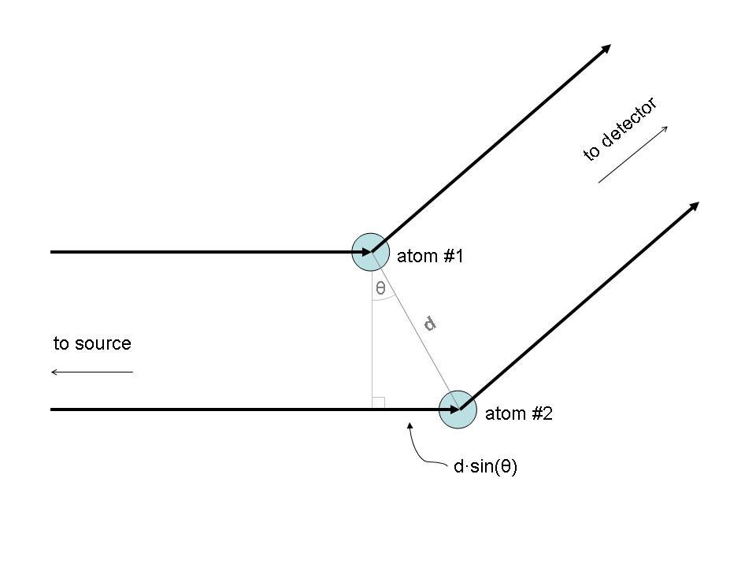
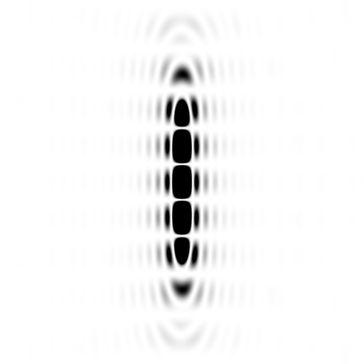
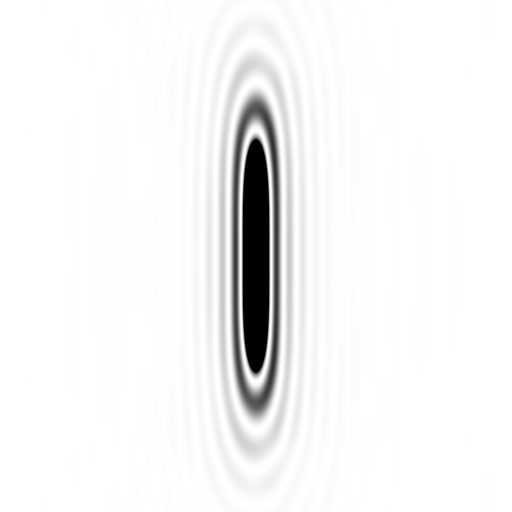
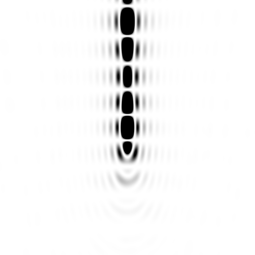
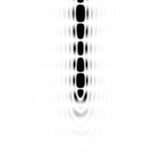
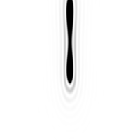
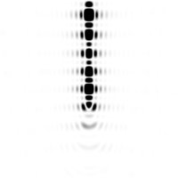
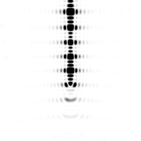
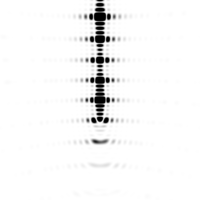

# nearBragg demonstration of Bragg's Law

Bragg's Law is not a Fourier transform.

Remember, in the standard diagram of Bragg's Law:

there are only two atoms that are `d` apart.  However, the full diffraction
pattern from just two atoms actually looks like this:

If you download the [ADSX format image file](intimage_twoatom.img) you can look
at it in your favorite diffraction image viewer, such as [ADXV][adxv],
[imosflm][imosflm], [HKL2000/3000][hkl], [XDSViewer][xdsviewer], [Fit2D][fit2d]
or whatever you like.

Note: you can substitute `img` for any of the `png` filenames linked from this
page and download the `img` file.

Notice how there are 9 bands for only 2 atoms?  If you look at the
[*.img file](intimage_twoatom.img) you can see that the `d spacing` of the
middle of each line is indeed 10 Å, 5 Å, 3.33 Å, and 2.5 Å.  Just as Bragg's
Law predicts for n=1, 2, 3, 4 because the two atoms were 10 Å apart
(`d` = 10 A) and the wavelength was 1 Å.

But what about the corners? The 2.5 Å band reads a `d-spacing` of 1.65 Å at the
corners of the detector!  Also, if you look at the central band, it passes
through the direct beam (`d`=infinity), but at the edge of the detector this
same band reads 2.14 Å! Does this mean that Bragg's Law is wrong!?

Of course not, it just means that Bragg's Law is one dimensional. Strictly
speaking, it is about planes of atoms, not individual atoms themselves.
The Fourier transform of two dots is indeed a series of bands
(an "interference pattern"), but the Fourier transform of two planes
(edge-on to the beam) is this:

What?  A caterpillar?  How does that happen?  Well, it helps to look at the
diffraction pattern of a single plane:

I should point out here that I'm not modelling an infinite plane, but rather a
disk 20 Å in radius. This is why the edge of the caterpillar has a `d-spacing` 
of 40 Å in the [*.img file](20A_disk.img). If it were an infinite plane, its
Fourier transform would be an infinitely thin line, visible at only one point:
the origin.  Which is not all that interesting. The "halo" around the main line
is because the plane has a "hard" edge, and so its Fourier transform has
"fringes" (its a "sinc" function). The reason why it does not run from the top
of the image to the bottom is because the Ewald sphere
(a geometric representation of Bragg's law) is curved, but the Fourier
transform of a disk is a straight line in reciprocal space.

By giving the plane a finite size you can more easily see that the diffraction
pattern of a stack of two planes is nothing more than the diffraction pattern
of one plane, multiplied by that of two points. This is a fundamental property
of Fourier transforms: convolution becomes a product in reciprocal space. Where
"convolution" is nothing more than "copying" an object to different places in
space, and in this case these "places" are the two points in the Bragg diagram.

But, still, why the caterpillar?  It is because the Ewald sphere is curved, so
the reciprocal-space "line" only brushes against it for a few orders.  We can,
however, get more orders by tilting the planes by some angle "theta", such as
the 11.53 degrees that satisfies `n*lambda = 2*d*sin(theta)` for n = 4.
That is this image:

Yes, you can still see the caterpillar, but in the
[*.img file](tilted_20A_disks.img) clearly the 4th "spot" up is brighter than
all but the 0th-order one. The only reason why it is not identical in intensity
is because of the inverse square law: the pixels on the detector for the
4th-order "reflection" are a little further away from the "sample" than the
zeroeth-order ones.

 As the planes get wider:

the "caterpillar" gets thinner you see less and less of the n=1, 2, 3 orders.
For an infinite pair of planes, there will be only two intersection points: the
origin and the n=4 spot. This is not because the intermediate orders are not
there, they are just not satisfying the "Bragg condition", and neither are
their "fringes".

Of course, with only two planes, even the infinite-plane spot will be much
"fatter" in the vertical.  Formally, about half as "fat" as the distance
between the spots. This is because the interference pattern for only two points
is still there. But if you have three, four or five planes, you get these:

Where you can see the "subsidiary maxima" in between the "Bragg peaks".
There has been some excitement about these of late for phasing XFEL images, and
they only show up for crystals that are relatively few unit cells wide. That
is, the number of subsidiary maxima is proportional to the number of planes
(stacks of unit cells), but their intensity fades relative to the Bragg peaks
with the square of the number of planes, which you can confirm with the
["img" files](tilted_20A_5disks.img) and a diffraction image viewer.

How does all this relate to structure factors?  Well, actually, it doesn't.
Everywhere on all of these images the structure factor has an amplitude of one
and a phase of zero.  This is because there is only one electron in the
"unit cell" here, and all the fancy shapes are actually due to the "lattice".
If we want to talk about a "unit cell" with two atoms in it, then there are
two, overlapping lattices, and they interfere with each other in the usual
"convolution becomes a product" way. That is, you can calculate the diffraction
pattern for two points, and then multiply that diffraction pattern by that of
the "lattice" with only one electron per unit cell.  In this way, you can build
up anything you want, but Bragg's genius was in simplifying all this to a
little rule which tells you how much to turn the crystal to see a given spot.
We sort of take this for granted now that we have automated diffractometers
that do all the math for us, but in 1914 realizing that the rules or ordinary
optics could be applied to x-rays and crystals was a pretty important step
forward.

-James Holton 
MAD Scientist 

[adxv]: https://www.scripps.edu/tainer/arvai/adxv.html
[imosflm]: https://www.mrc-lmb.cam.ac.uk/harry/imosflm/ver740/introduction.html
[hkl]: https://hkl-xray.com
[xdsviewer]: http://xds-viewer.sourceforge.net
[fit2d]: https://www.esrf.fr/computing/scientific/FIT2D/
